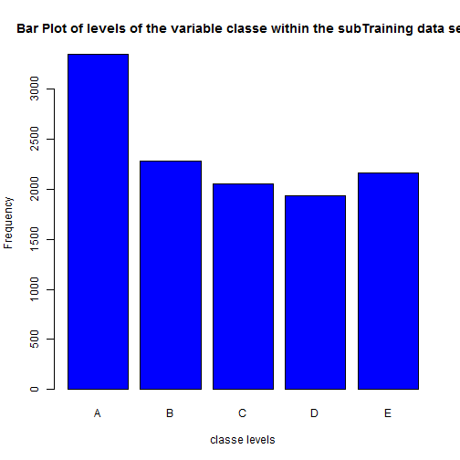
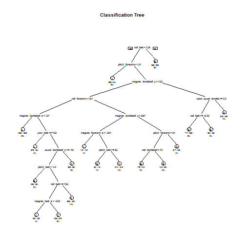

```r
library("caret")
```

```
## Loading required package: lattice
## Loading required package: ggplot2
```

```r
library("rpart")
library("rpart.plot")
library("randomForest")
```

```
## randomForest 4.6-10
## Type rfNews() to see new features/changes/bug fixes.
```

```r
trainUrl<-"http://d396qusza40orc.cloudfront.net/predmachlearn/pml-training.csv"
testUrl<-"https://d396qusza40orc.cloudfront.net/predmachlearn/pml-testing.csv"

#download.file(trainUrl, destfile="C:/Users/weibinkelvin/Documents/trainset.csv")
#download.file(testUrl, destfile="C:/Users/weibinkelvin/Documents/testset.csv")
trainset<-read.csv("C:/Users/weibinkelvin/Documents/trainset.csv", na.strings=c("NA","#DIV/0!",""))
testset<-read.csv("C:/Users/weibinkelvin/Documents/testset.csv", na.strings=c("NA","#DIV/0!",""))

trainset<-trainset[,colSums(is.na(trainset)) == 0]
testset <-testset[,colSums(is.na(testset)) == 0]

trainset   <-trainset[,-c(1:7)]
testset <-testset[,-c(1:7)]

inTrain <- createDataPartition(y=trainset$classe, p=0.6, list=FALSE)
myTraining <- trainset[inTrain, ]; 
myTesting <- trainset[-inTrain, ]
dim(myTraining)
```

```
## [1] 11776    53
```

```r
dim(myTesting)
```

```
## [1] 7846   53
```

```r
plot(myTraining$classe, col="blue", main="Bar Plot of levels of the variable classe within the subTraining data set", xlab="classe levels", ylab="Frequency")
```

 

```r
model1 <- rpart(classe ~ ., data=myTraining, method="class")

prediction1 <- predict(model1, myTesting, type = "class")

rpart.plot(model1, main="Classification Tree", extra=102, under=TRUE, faclen=0)
```

 

```r
#if image is too small, may consider the below code the generate bigger tree.
#png("test.png", width=1024, height=800)
#rpart.plot(model1, main="Classification Tree", extra=102, under=TRUE, faclen=0)
#dev.off()
confusionMatrix(prediction1, myTesting$classe)
```

```
## Confusion Matrix and Statistics
## 
##           Reference
## Prediction    A    B    C    D    E
##          A 1840  294   34  120   51
##          B   64  806   83   28   78
##          C   67  123 1016  203  171
##          D  238  234  159  852  240
##          E   23   61   76   83  902
## 
## Overall Statistics
##                                           
##                Accuracy : 0.6903          
##                  95% CI : (0.6799, 0.7005)
##     No Information Rate : 0.2845          
##     P-Value [Acc > NIR] : < 2.2e-16       
##                                           
##                   Kappa : 0.6085          
##  Mcnemar's Test P-Value : < 2.2e-16       
## 
## Statistics by Class:
## 
##                      Class: A Class: B Class: C Class: D Class: E
## Sensitivity            0.8244   0.5310   0.7427   0.6625   0.6255
## Specificity            0.9111   0.9600   0.9129   0.8672   0.9621
## Pos Pred Value         0.7867   0.7611   0.6430   0.4945   0.7878
## Neg Pred Value         0.9288   0.8951   0.9438   0.9291   0.9194
## Prevalence             0.2845   0.1935   0.1744   0.1639   0.1838
## Detection Rate         0.2345   0.1027   0.1295   0.1086   0.1150
## Detection Prevalence   0.2981   0.1350   0.2014   0.2196   0.1459
## Balanced Accuracy      0.8677   0.7455   0.8278   0.7649   0.7938
```

Prediction using Random Forest


```r
model2 <- randomForest(classe ~. , data=myTraining, method="class")
prediction2 <- predict(model2, myTesting, type = "class")
confusionMatrix(prediction2, myTesting$classe)
```

```
## Confusion Matrix and Statistics
## 
##           Reference
## Prediction    A    B    C    D    E
##          A 2227   16    0    0    0
##          B    4 1497    9    0    0
##          C    0    5 1358   12    2
##          D    0    0    1 1273    7
##          E    1    0    0    1 1433
## 
## Overall Statistics
##                                           
##                Accuracy : 0.9926          
##                  95% CI : (0.9905, 0.9944)
##     No Information Rate : 0.2845          
##     P-Value [Acc > NIR] : < 2.2e-16       
##                                           
##                   Kappa : 0.9906          
##  Mcnemar's Test P-Value : NA              
## 
## Statistics by Class:
## 
##                      Class: A Class: B Class: C Class: D Class: E
## Sensitivity            0.9978   0.9862   0.9927   0.9899   0.9938
## Specificity            0.9971   0.9979   0.9971   0.9988   0.9997
## Pos Pred Value         0.9929   0.9914   0.9862   0.9938   0.9986
## Neg Pred Value         0.9991   0.9967   0.9985   0.9980   0.9986
## Prevalence             0.2845   0.1935   0.1744   0.1639   0.1838
## Detection Rate         0.2838   0.1908   0.1731   0.1622   0.1826
## Detection Prevalence   0.2859   0.1925   0.1755   0.1633   0.1829
## Balanced Accuracy      0.9975   0.9921   0.9949   0.9943   0.9967
```

Conclusion: Random Forest is a better model for the data. 


```r
predictfinal<-predict(model2, testset, type="class")
predictfinal
```

```
##  1  2  3  4  5  6  7  8  9 10 11 12 13 14 15 16 17 18 19 20 
##  B  A  B  A  A  E  D  B  A  A  B  C  B  A  E  E  A  B  B  B 
## Levels: A B C D E
```

```r
pml_write_files = function(x){
  n = length(x)
  for(i in 1:n){
    filename = paste0("problem_id_",i,".txt")
    write.table(x[i],file=filename,quote=FALSE,row.names=FALSE,col.names=FALSE)
  }
}

pml_write_files(predictfinal)
```
